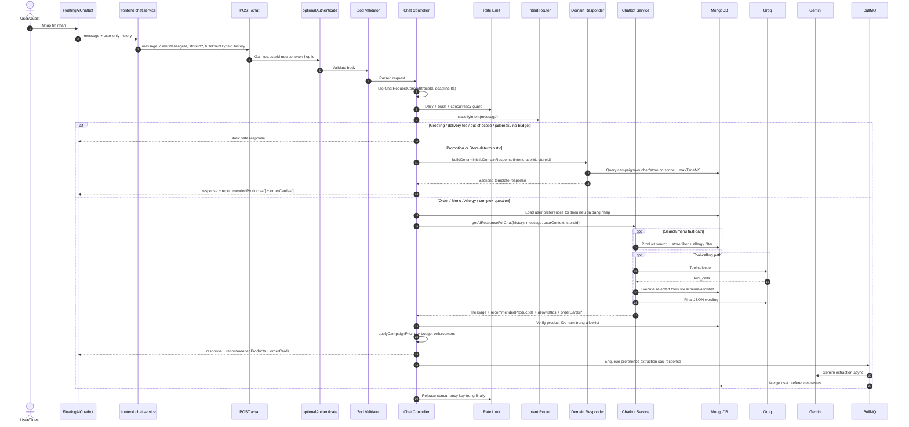

# He thong AI Chatbot FOA hien tai

Tai lieu nay mo ta flow chatbot dang chay trong code sau dot hardening gan nhat. Muc tieu cua flow hien tai la giu backend lam nguon su that, chi de LLM ho tro phan loai, chon tool va dien tham so co schema khi can.

Nguyen tac bat buoc:

- Backend la authoritative layer cho database, gia, campaign price, budget, quyen xem don va loc di ung.
- AI output luon la untrusted input.
- Product ID tu AI phai nam trong allowlist do backend tao.
- Order, voucher, user id va permission khong duoc lay tu client hay tu LLM.
- Khong gui secret, token, cookie, payment payload, password, OTP hoac raw private logs sang AI provider.
- Log chi ghi metadata nhe, khong ghi raw conversation hay thong tin nhay cam.

---

## 1. Flow tong the qua tung layer

Endpoint:

- Route: `POST /chat`
- Backend route: `backend/src/routes/chat.route.ts`
- Controller: `backend/src/controllers/chat.controller.ts`
- Frontend service: `frontend/src/services/chat.service.ts`
- UI: `frontend/src/components/shared/FloatingAIChatbot.tsx`



---

## 2. Frontend layer

File chinh:

- `frontend/src/components/shared/FloatingAIChatbot.tsx`
- `frontend/src/services/chat.service.ts`

UI layer dang lam:

- Luu message trong component/session UI de hien thi.
- Khi gui request, chi gui lai cac message co `role: "user"`.
- Tao `clientMessageId` bang id cua user message.
- Nhan response gom:
  - `response`
  - `recommendedProducts`
  - `orderCards`

Frontend render:

- Product card co nut `Xem`, navigate den `/food/:id`.
- Order card co nut `Xem don`, navigate den `/orders/:id`.
- Assistant history trong UI khong duoc gui lai nhu canonical prompt context.

Request contract tu frontend:

```ts
{
  message: string;
  clientMessageId?: string;
  conversationId?: string;
  storeId?: string;
  fulfillmentType?: "delivery" | "pickup" | "dine_in";
  history: Array<{
    role: "user";
    content: string;
  }>;
}
```

---

## 3. API, auth va validation layer

File chinh:

- `backend/src/routes/chat.route.ts`
- `backend/src/validators/chat.validator.ts`
- `backend/src/controllers/chat.controller.ts`

Validation hien tai:

```ts
{
  message: string; // 1..1000 ky tu
  clientMessageId?: string; // 1..100
  conversationId?: string; // max 100
  storeId?: string; // ObjectId optional
  fulfillmentType?: "delivery" | "pickup" | "dine_in";
  locale?: string; // default vi-VN
  timezone?: string; // default Asia/Ho_Chi_Minh
  history?: Array<{
    role: "user";
    content: string; // 1..2000
  }>; // max 20
}
```

Quan trong:

- Validator khong chap nhan `role: "assistant"` hay `role: "model"` tu client.
- `storeId` phai la ObjectId neu co.
- `req.userId` den tu auth middleware, khong den tu body.
- Controller chi load `preferences` cua user, khong load du lieu ca nhan du thua.

---

## 4. Deadline, tracing va rate limit layer

File chinh:

- `backend/src/services/chat-deadline.service.ts`
- `backend/src/services/chat-observability.service.ts`
- `backend/src/services/chat-rate-limit.service.ts`

### Deadline

Moi request co `ChatRequestContext`:

- `traceId`
- `startedAt`
- `deadlineAt`
- `AbortSignal`
- global deadline mac dinh: 8 giay

Moi Groq/Gemini stage dung `withChatDeadline` hoac timeout rieng de tranh giu request qua lau.

### Tracing

`logChatStage` ghi metadata nhe theo stage:

- validate
- rate_limit
- intent
- domain_response
- response
- error

Khong log raw message, token, cookie, payment payload hay full conversation.

### Rate limit

Redis key dang dung:

- Daily:
  - User: 20 cau/ngay.
  - Guest: 5 cau/ngay.
- Burst:
  - User: 6 cau/phut.
  - Guest: 3 cau/phut.
- Concurrency:
  - User: 2 request dang xu ly.
  - Guest: 1 request dang xu ly.

Neu Redis loi:

- Guest hoac production: fail closed `503`.
- User da dang nhap o non-production: cho di tiep va warn.

---

## 5. Intent router layer

File chinh: `backend/src/services/chatbot.service.ts`

Intent hien tai:

- `GREETING`
- `MENU_SEARCH`
- `ALLERGY_SAFE_RECOMMENDATION`
- `ORDER_STATUS`
- `DELIVERY_FEE`
- `PROMOTION`
- `STORE_HOURS`
- `OUT_OF_SCOPE`
- `JAILBREAK`

Flow phan loai:

1. `classifyIntentByRules(message)` chay truoc.
2. Neu rule khong chac, goi Groq intent model voi JSON schema.
3. Neu Groq loi hoac JSON sai, fallback ve `MENU_SEARCH`.

Luu y hien trang:

- Intent router van co rule-based/regex classifier cho cac nhom lon.
- Order status khong con bi backend parse status bang regex nua.
- Cac cau hoi can tham so dong nen di tiep vao Chatbot Service/tool-calling.

---

## 6. Domain responder layer hien tai

File chinh: `backend/src/services/chat-domain-response.service.ts`

Domain responder hien chi xu ly deterministic cho cac domain it tham so dong:

| Domain | Dieu kien vao | Backend query | Response |
|---|---|---|---|
| Campaign | `intent === "PROMOTION"` va khong bi nhan la voucher | `CampaignModel` approved + trong thoi gian hieu luc | Backend template text |
| Voucher | `intent === "PROMOTION"` va message match voucher keywords | `UserVoucherModel` theo `userId`, `status: "available"` | Backend template text |
| Store | `intent === "STORE_HOURS"` hoac message match store keywords | `StoreModel`, `StoreSettingsModel`, uu tien `storeId` neu co | Backend template text |

Quan trong:

- Order khong con nam trong deterministic domain responder.
- Domain responder tra `recommendedProducts: []` va `orderCards: []`.
- Campaign/voucher/store hien van co regex nho de phan nhanh voucher/store trong service nay. Day la hien trang code, chua phai kien truc tool-calling hoan toan.

Huong nen nang cap tiep:

- Chuyen campaign/voucher/store sang tool-calling co schema neu can ho tro nhieu bien the cau hoi hon.
- Vi du:
  - `get_active_campaigns({ activeOnly, limit })`
  - `get_user_vouchers({ status, limit })`
  - `get_store_list({ district?, openNow?, limit })`
- Backend van validate schema va khong cho LLM truyen `userId`.

---

## 7. Chatbot service layer

File chinh: `backend/src/services/chatbot.service.ts`

`getAIResponseForChat` xu ly cac cau khong duoc controller/domain responder tra ngay.

### 7.1 Search plan

Service goi `buildHybridSearchPlan(message)`:

- Neu deterministic parser trong `chat-query-planner.service.ts` du thong tin thi dung luon.
- Neu can semantic parser, goi Groq semantic planner JSON.
- Output search plan co the gom:
  - budget
  - combo intent
  - category
  - health needs
  - exclude traits
  - query da clean/expand

### 7.2 Fast-path khong can Groq chat

Neu message ro rang thuoc cac nhom sau, service co the search deterministic truoc:

- no-budget
- budget combo
- combo
- health constraints nhu tieu duong/it duong
- exclude traits nhu khong nong
- include tastes

Flow:

1. Search products trong DB.
2. Loc store neu co `storeId`.
3. Loc di ung neu user co allergies.
4. Tao `allowlistIds`.
5. Tra message + `recommendedProductIds`.

### 7.3 Tool-calling path

Neu can LLM chat/tool, service goi Groq 2 luot:

1. Luot chon tool:
   - `search_products`
   - `search_allergy_safe_products`
   - `get_active_campaigns`
   - `get_hot_products`
   - `get_user_vouchers`
   - `get_user_order_history`
   - `get_store_list`
   - `check_product_store_availability`
2. Backend execute tool bang code noi bo.
3. Luot final JSON de Groq dien dat ket qua thanh:

```ts
{
  message: string;
  recommendedProductIds: string[];
}
```

Backend validate final JSON bang Zod.

---

## 8. Order status flow hien tai

Order flow hien tai di qua tool-calling, khong con deterministic regex status filter.

Layer-by-layer:

1. Frontend gui cau hoi, vi du: "cac don hang chua duoc giao".
2. Validator chi chap nhan `message` va user-only history.
3. Controller lay `userId` tu auth middleware.
4. Intent router phan loai `ORDER_STATUS`.
5. Domain responder bo qua order va tra `null`.
6. Controller load `user.preferences` toi thieu neu co.
7. Chatbot Service goi Groq tool selection.
8. LLM chon `get_user_order_history` va dien args:

```ts
{
  statuses?: Array<
    | "pending"
    | "confirmed"
    | "processing"
    | "preparing"
    | "ready_for_delivery"
    | "shipping"
    | "delivering"
    | "delivered"
    | "completed"
    | "cancelled"
    | "refunded"
  >;
  limit?: number; // 1..5
}
```

9. Backend validate args bang `orderHistoryToolArgsSchema`.
10. Query Mongo luon bi scope:

```ts
{
  cusId: userContext.userId,
  status?: { $in: validatedStatuses }
}
```

11. Backend build `orderCards`:

```ts
{
  _id: string;
  code: string;
  status: string;
  totalPrice: number;
  createdAt: string;
  firstItemName?: string;
  itemCount: number;
}
```

12. Neu Groq final response loi sau khi tool order da chay, backend fallback bang `buildOrderToolFallbackResponse`.
13. Controller tra `response + orderCards`.
14. UI render order card va nut `Xem don`.

Dieu LLM khong duoc lam:

- Khong duoc truyen `userId`.
- Khong duoc quyet dinh quyen xem don.
- Khong duoc sua status/order/payment.
- Khong duoc lay qua 5 don.

---

## 9. Product search, allergy va pricing flow

Product search nam trong `fetchAndFilterSafeProducts`.

Flow search:

1. Query goc: `isAvailable: true`.
2. Neu co `storeId`, loc `storeAvailability` voi `status === active`.
3. Neu co category, map ve category cua database.
4. Neu co query text:
   - Atlas Search lexical.
   - Gemini embedding.
   - Atlas Vector Search.
   - RRF fusion.
5. Neu Atlas Search loi: fallback `$text`, sau do top products theo rating/review/price.
6. Neu Atlas Vector loi: lexical-only fallback, khong cosine in-memory tren toan collection.
7. Loc theo health/trait.
8. Loc di ung:
   - `allergenTags`
   - `mayContain`
   - `crossContaminationRisk`
   - `recipe[].name`
   - `ALLERGEN_CATALOG.aliases`
9. Tao allowlist IDs.

Controller verify sau cung:

1. Chi giu `recommendedProductIds` nam trong `allowlistIds`.
2. Query lai Product tu MongoDB.
3. Goi `applyCampaignPricing`.
4. Neu co `budgetVnd`, cat danh sach sao cho tong khong vuot ngan sach.
5. Tra `recommendedProducts` cho frontend.

---

## 10. Campaign, voucher, store hien tai

### Campaign

Hien co 2 duong co the cham campaign:

- Deterministic domain responder neu intent la `PROMOTION` va khong phai voucher.
- Tool `get_active_campaigns` neu cau hoi di qua Chatbot Service.

Deterministic responder query:

- `status` trong `APPROVED` hoac `approved`.
- `startTime <= now`.
- `endTime >= now`.
- limit 5.

Tool path query campaign va populate `products.productId`, sau do them product IDs vao allowlist neu co san pham trong campaign.

### Voucher

Hien co 2 duong:

- Deterministic domain responder neu promotion message match voucher keywords.
- Tool `get_user_vouchers` neu cau hoi di qua Chatbot Service.

Ca hai duong deu:

- Yeu cau user da dang nhap.
- Query theo `userId` tu auth/userContext.
- Chi lay `status: "available"`.
- Khong cho LLM/client truyen user id.

### Store

Hien co 2 duong:

- Deterministic domain responder cho `STORE_HOURS` hoac store keywords.
- Tool `get_store_list` neu cau hoi di qua Chatbot Service.

Deterministic responder:

- Neu co `storeId` hop le: lay store + settings cua store do.
- Neu khong co: list toi da 5 store active.

Tool `get_store_list`:

- List toi da 5 store active voi name/address/district.

Gioi han hien tai:

- Store/campaign/voucher chua co schema tham so dong giau nhu order.
- Neu muon bot hieu cac cau phuc tap hon, nen chuyen cac domain nay sang tool-calling schema o buoc tiep theo.

---

## 11. Preference extraction async

File chinh:

- `backend/src/jobs/chat-preference-queue.ts`
- `backend/src/services/chatbot.service.ts`
- `backend/src/index.ts`

Flow:

1. Controller tra response chat truoc.
2. Neu user da dang nhap, controller enqueue job:

```ts
{
  userId,
  messageId: clientMessageId,
  message
}
```

3. BullMQ worker goi `extractPreferencesFromMessage`.
4. Gemini trich xuat tastes thanh JSON array.
5. Backend validate bang Zod.
6. Merge vao `user.preferences.tastes`.

Worker settings:

- attempts: 2
- exponential backoff 5s
- concurrency: 2
- limiter: 5 jobs/giay

---

## 12. AI provider va model registry

File chinh:

- `backend/src/services/ai-model-registry.service.ts`
- `backend/src/constants/env.ts`

Use case hien tai:

| Use case | Provider | ENV |
|---|---|---|
| Chat/tool calling | Groq | `GROQ_CHAT_MODEL` |
| Intent classifier | Groq | `GROQ_INTENT_MODEL` |
| Semantic planner | Groq | `GROQ_SEMANTIC_PLANNER_MODEL` |
| Preference extraction | Gemini | `GEMINI_MODEL` |

Neu `GROQ_CHAT_MODEL` van la `llama-3.1-8b-instant`, app warn luc khoi dong vi model co lich deprecation.

Du lieu co the gui sang Groq:

- Message hien tai.
- User-only history da validate.
- Preferences rut gon: allergies, dietary, healthGoals, tastes.
- Tool results rut gon.

Du lieu co the gui sang Gemini:

- Query text de embedding search.
- Message de preference extraction async.

Du lieu khong duoc gui sang AI provider:

- JWT/cookie/raw auth header.
- Payment payload/signature.
- Password/OTP/private key.
- Raw production logs.
- Full order/payment sensitive data.

---

## 13. Gioi han va viec nen lam tiep

Gioi han hien tai:

- Intent router van co rule-based regex classifier cho nhom lon.
- Campaign/voucher/store trong domain responder van co regex nho de phan nhanh voucher/store.
- Order da dung tool-calling schema, nhung campaign/voucher/store chua co tool args schema giau.
- `AbortSignal` da co trong request context, nhung SDK ben duoi co the chua huy HTTP request that su.
- History canonical server-side chua duoc luu trong conversation store.
- Observability moi la log JSON nhe, chua co OpenTelemetry/Prometheus.
- Product health metadata con phu thuoc du lieu hien co.

Huong nang cap tiep neu muon giam regex hon nua:

1. Chuyen `PROMOTION` thanh tool route hoan toan:
   - `get_active_campaigns({ activeOnly, limit })`
   - `get_user_vouchers({ status, limit })`
2. Chuyen store sang tool route co tham so:
   - `get_store_list({ district?, openNow?, limit })`
   - `get_store_hours({ storeId? })`
3. Giam `classifyIntentByRules` xuong chi con guardrail cuc ro:
   - jailbreak
   - greeting
   - no-budget
4. Them schema/Zod cho tool args cua campaign/voucher/store nhu order.
5. Them conversation store server-side neu can context dai va tin cay hon.

---

## 14. File lien quan

- `backend/src/controllers/chat.controller.ts` - orchestration, validation result handling, rate limit, deterministic route, allowlist verify, pricing, queue preference job.
- `backend/src/validators/chat.validator.ts` - request schema va user-only history.
- `backend/src/services/chatbot.service.ts` - intent, search plan, product search, allergy filter, tool-calling, order cards, final JSON validation.
- `backend/src/services/chat-domain-response.service.ts` - deterministic campaign/voucher/store response.
- `backend/src/services/chat-rate-limit.service.ts` - Redis daily/burst/concurrency guard.
- `backend/src/services/chat-deadline.service.ts` - request deadline context.
- `backend/src/services/chat-observability.service.ts` - trace metadata log.
- `backend/src/services/ai-model-registry.service.ts` - model registry va deprecation warning.
- `backend/src/jobs/chat-preference-queue.ts` - BullMQ preference extraction worker.
- `backend/src/services/chat-query-planner.service.ts` - deterministic search plan cho budget/combo/health query.
- `frontend/src/services/chat.service.ts` - API client gui `clientMessageId` va user-only history.
- `frontend/src/components/shared/FloatingAIChatbot.tsx` - chat UI, product card, order card.
