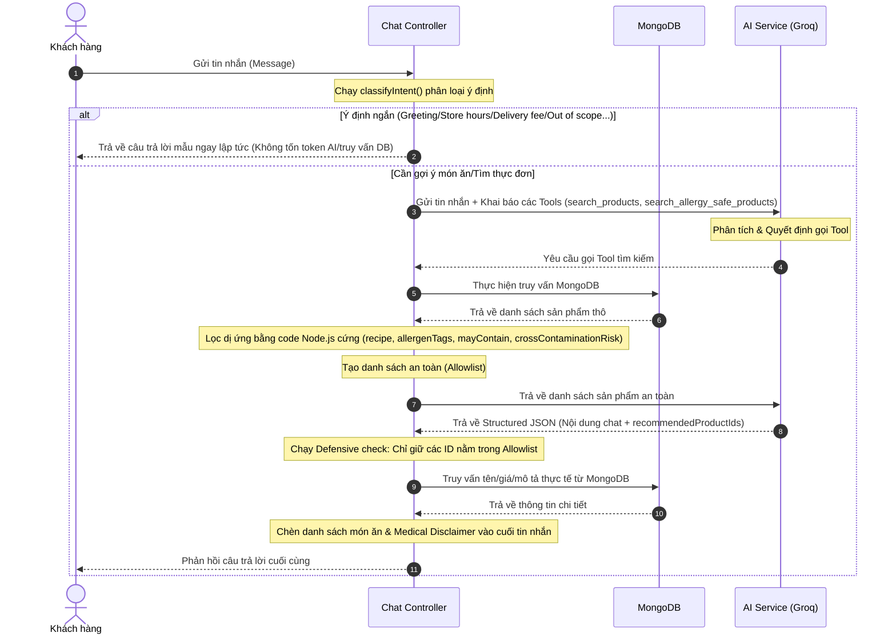

# HỆ THỐNG CHATBOT TƯ VẤN DINH DƯỠNG & ĐẶT MÓN FOA (PRODUCTION-SAFE)

Hệ thống chatbot của FOA được thiết kế để hỗ trợ thực khách tìm kiếm món ăn, tư vấn dinh dưỡng và kiểm tra thông tin đơn hàng một cách nhanh chóng, chính xác. Điểm đặc biệt nhất là hệ thống được xây dựng theo kiến trúc phòng thủ **"Backend kiểm soát an toàn, LLM chịu trách nhiệm diễn đạt"** để bảo đảm an toàn dị ứng tuyệt đối cho người dùng.

---

## 1. Kiến Trúc Luồng Hoạt Động (System Flow)

Kiến trúc chatbot mới loại bỏ quyền tự quyết định an toàn của mô hình ngôn ngữ lớn (LLM) và thay thế bằng logic lập trình deterministic ở Backend thông qua chuỗi xử lý nghiêm ngặt sau:



---

## 2. Các Thành Phần Chính

### A. Intent Router (Bộ Phân Loại Ý Định)
Khi nhận tin nhắn, hàm `classifyIntent` (sử dụng mô hình `llama-3.1-8b-instant` qua Groq) sẽ phân tích nhanh và định tuyến tin nhắn:
* **Xử lý bằng Template (Quy tắc tĩnh):**
  * `GREETING`: Trả về câu chào mừng và giới thiệu vai trò của bot.
  * `STORE_HOURS`: Trả về giờ hoạt động (7:00 AM - 10:00 PM).
  * `DELIVERY_FEE`: Trả về chính sách phí giao hàng (Free <2km, từ 2km tính phí 15k-25k).
  * `PROMOTION`: Gợi ý mã giảm giá 10% cho khách hàng mới.
  * `ORDER_STATUS`: Hướng dẫn kiểm tra trạng thái đơn hàng trong phần Lịch sử đơn hàng.
  * `OUT_OF_SCOPE`: Từ chối lịch sự khi khách hỏi các chủ đề ngoài F&B (lập trình, toán học, chính trị...).
  * `JAILBREAK`: Ngăn chặn các nỗ lực xâm nhập hệ thống, đánh cắp prompt hoặc khóa API.
* **Xử lý bằng Luồng AI Chính:** Chỉ các ý định `MENU_SEARCH` và `ALLERGY_SAFE_RECOMMENDATION` mới đi tiếp vào luồng AI có gọi database.

### B. Tool Calling (Gọi công cụ) & Backend Safety Filter
AI được trang bị 2 công cụ (Tools) để tương tác với cơ sở dữ liệu:
* `search_products(query, category)`: Tìm kiếm sản phẩm thông thường.
* `search_allergy_safe_products(query)`: Tìm kiếm sản phẩm an toàn với thể trạng người dùng.

Khi AI kích hoạt gọi Tool, Backend Node.js thực thi logic lọc dị ứng cứng:
1. Đọc danh sách dị ứng của người dùng từ hồ sơ cá nhân (`user.preferences.allergies`).
2. Truy vấn danh sách món ăn từ MongoDB.
3. Chạy thuật toán lọc so khớp:
   * **Allergen Tags:** Loại bỏ các món có chứa chất dị ứng trong trường `allergenTags` hoặc `mayContain` (ví dụ: `shrimp`, `peanuts`, `dairy`).
   * **Nguy cơ nhiễm chéo:** Nếu sản phẩm có trường `crossContaminationRisk: true` và người dùng có dị ứng $\rightarrow$ Loại bỏ lập tức để tránh sốc phản vệ.
   * **Nguyên liệu bổ trợ:** Quét chuỗi dị ứng trong nguyên liệu thực tế (`recipe`) của món ăn để đảm bảo không bị gán thiếu tag.
4. Lưu trữ các ID an toàn vào mảng **`allowlistIds`** để làm mốc đối chiếu đầu ra.

### C. Structured JSON & Defensive Output Validation
AI được cấu hình để bắt buộc phản hồi dưới dạng Structured JSON:
```json
{
  "message": "Nội dung văn bản tư vấn và phản hồi...",
  "recommendedProductIds": ["id_mon_1", "id_mon_2"]
}
```
Tại Controller, Backend thực hiện bước kiểm duyệt cuối cùng trước khi hiển thị:
* Loại bỏ mọi ID trong `recommendedProductIds` không có tên trong `allowlistIds`. Điều này ngăn chặn triệt để hiện tượng AI bịa đặt (hallucination) ra món ăn không an toàn do lỗi suy luận hoặc do Prompt Injection từ phía người dùng.
* Lấy thông tin giá tiền và mô tả thực tế trực tiếp từ MongoDB cho các ID món ăn hợp lệ để chèn vào tin nhắn. AI không tự quyết định giá cả, giúp đồng bộ hóa chính xác giá bán của cửa hàng.

### D. Medical Disclaimer (Cảnh báo y tế)
* Mọi tin nhắn tư vấn liên quan đến dị ứng sẽ tự động được hệ thống đính kèm lời cảnh báo miễn trừ trách nhiệm y tế:
  > **Lưu ý:** *"Mặc dù hệ thống đã lọc, xin lưu ý quá trình chế biến tại bếp vẫn có nguy cơ nhiễm chéo. Vui lòng xác nhận lại với nhân viên nếu bạn bị dị ứng cực kỳ nặng."*

---

## 3. Tìm Kiếm Ngữ Nghĩa & Quản Lý Tài Nguyên (Hybrid Search & Rate Limiting)

### A. Hybrid Search & Category Mapping
* **Tìm kiếm ngữ nghĩa (Semantic Search):** Backend sử dụng mô hình `models/gemini-embedding-2` của Gemini để sinh vector embedding cho câu hỏi của khách hàng, sau đó tính toán **Độ tương đồng Cosine (Cosine Similarity)** trực tiếp trên bộ nhớ đệm (in-memory) của danh sách món ăn từ MongoDB. Hệ thống lọc các món có điểm tương đồng > 0.35 trước khi đưa qua bộ lọc an toàn dị ứng.
* **Bộ chuyển đổi danh mục (Category Mapping):** Nhận diện và tự động ánh xạ các danh mục đơn giản mà AI gửi lên (ví dụ: `Món nước`, `Cơm`, `Healthy`) sang danh mục hiển thị thực tế của cửa hàng trong database (ví dụ: `Trứ Danh Món Nước`, `Cơm Đĩa Truyền Thống`, `Góc Healthy & Ăn Kiêng`) để tránh kết quả rỗng.
* **Cơ chế Fallback (Dự phòng):** Nếu API sinh Embedding gặp lỗi hoặc quá tải quota, hệ thống sẽ tự động hạ cấp xuống tìm kiếm từ khóa Regex MongoDB thông thường để bảo đảm chatbot không bị gián đoạn.

### B. Rate Limiting (Giới hạn lượt hỏi kép)
Để kiểm soát chi phí API Key và ngăn chặn việc bot/script tự động spam cạn kiệt tài nguyên:
* **Khách vãng lai (Guest):** Giới hạn tối đa **5 câu hỏi**. 
  * *Frontend:* Tự động đếm và khóa ô nhập liệu khi chạm ngưỡng, hiển thị biểu ngữ (banner) mời Đăng nhập kèm nút chuyển hướng nhanh.
  * *Backend (Rate Limiter IP):* Quét địa chỉ IP của client (thông qua `X-Forwarded-For` khi chạy sau Proxy), lưu trữ số lượt chat vào Redis theo key `chat_limit:guest:${sanitizedIp}:${today}` với thời gian hết hạn (EX) tự động sau 24h để ngăn chặn tối đa việc xóa bộ nhớ trình duyệt để hack lượt.
* **Thành viên đã đăng nhập (User):** Giới hạn tối đa **20 câu hỏi mỗi ngày**.
  * *Cơ chế:* Lưu trữ bảo mật ở Backend bằng Redis thông qua khóa định danh tài khoản `chat_limit:${userId}:${today}` (tự động hết hạn/hủy key sau 24h). Khi vượt ngưỡng, server trả về mã lỗi `429 Too Many Requests` và hiển thị thông báo trực tiếp vào khung chat.

---

## 4. Các Cải Tiến Trải Nghiệm Người Dùng (UX) ở Frontend
* **SPA Routing (Chuyển trang không reload):** Nút **"Xem"** trên card sản phẩm chuyển hướng bằng hook `useNavigate()` của React Router, thay đổi URL trực tiếp trên client để tránh làm trình duyệt phải tải lại toàn bộ trang web (reload).
* **Scroll Lock (Khóa thanh cuộn):** Sử dụng ref trực tiếp cho khung chứa tin nhắn (`chatContainerRef`) và ghi nhận sự thay đổi của `location.pathname` để ghim thanh cuộn ở dưới đáy tin nhắn khi chuyển trang, loại bỏ xung đột của trình duyệt với `scrollIntoView` do cơ chế *Scroll Restoration*.
* **Mouse Wheel Scroll (Cuộn chuột ngang):** Tích hợp hàm bắt sự kiện `onWheel` trên dải sản phẩm gợi ý để hỗ trợ người dùng máy tính sử dụng con lăn chuột cuộn dọc để trượt ngang danh sách sản phẩm một cách tự nhiên.
* **Markdown Custom Parser:** Sử dụng cấu phần `SimpleMarkdown` tự viết thay cho thư viện `react-markdown` để tránh xung đột kiểu JSX của React 19 và tối ưu hóa kích thước gói bundle.

---

## 5. Các File Mã Nguồn Liên Quan

* **Controller:** [chat.controller.ts](file:///Users/nguyenanh/Documents/SUBJECTS/SDN302/food_order_app/chain-restaurant-platform/backend/src/controllers/chat.controller.ts) - Điều phối request, định tuyến ý định, quản lý rate limit (IP & userId) qua Redis và gọi chatbot service.
* **Chatbot Service:** [chatbot.service.ts](file:///Users/nguyenanh/Documents/SUBJECTS/SDN302/food_order_app/chain-restaurant-platform/backend/src/services/chatbot.service.ts) - Chứa toàn bộ các hàm chatbot (phân loại ý định, gọi các tool, tìm kiếm ngữ nghĩa, và trích xuất sở thích khẩu vị người dùng).
* **AI Service:** [ai.service.ts](file:///Users/nguyenanh/Documents/SUBJECTS/SDN302/food_order_app/chain-restaurant-platform/backend/src/services/ai.service.ts) - Chứa các client kết nối chính đến mô hình AI (Gemini, Groq) và các tác vụ AI chung khác (Gợi ý trang chủ, Moderate bình luận).
* **Frontend Component:** [FloatingAIChatbot.tsx](file:///Users/nguyenanh/Documents/SUBJECTS/SDN302/food_order_app/chain-restaurant-platform/frontend/src/components/shared/FloatingAIChatbot.tsx) - Giao diện Chatbot, lưu giữ lịch sử qua `sessionStorage`, xử lý SPA routing, cuộn chuột ngang và render Markdown.
* **Model:** [product.model.ts](file:///Users/nguyenanh/Documents/SUBJECTS/SDN302/food_order_app/chain-restaurant-platform/backend/src/models/product.model.ts) - Schema chứa các thông số dị ứng và mảng vector `embedding` của sản phẩm.
