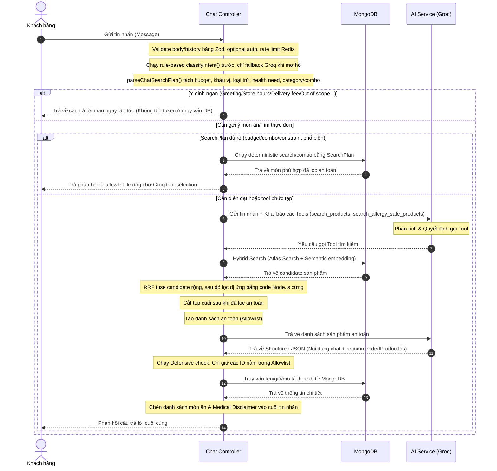

# HỆ THỐNG CHATBOT TƯ VẤN DINH DƯỠNG & ĐẶT MÓN FOA (PRODUCTION-SAFE)

Hệ thống chatbot của FOA được thiết kế để hỗ trợ thực khách tìm kiếm món ăn, tư vấn dinh dưỡng và kiểm tra thông tin đơn hàng một cách nhanh chóng, chính xác. Điểm đặc biệt nhất là hệ thống được xây dựng theo kiến trúc phòng thủ **"Backend kiểm soát an toàn, LLM chịu trách nhiệm diễn đạt"** để bảo đảm an toàn dị ứng tuyệt đối cho người dùng.

---

## 1. Kiến Trúc Luồng Hoạt Động (System Flow)

Kiến trúc chatbot mới loại bỏ quyền tự quyết định an toàn của mô hình ngôn ngữ lớn (LLM) và thay thế bằng logic lập trình deterministic ở Backend thông qua chuỗi xử lý nghiêm ngặt sau:



---

## 2. Các Thành Phần Chính

### A0. Hybrid Query Planner
Trước khi phụ thuộc vào Groq tool-selection, Backend chạy `parseChatSearchPlan(message)` để có kế hoạch deterministic fallback. Với câu menu còn mơ hồ, Backend gọi thêm một semantic planner JSON timeout thấp để chuyển ngôn ngữ tự nhiên thành một kế hoạch tìm kiếm có cấu trúc:

```ts
{
  budgetVnd: 100000,
  wantsCombo: true,
  preferredCategory: "Góc Healthy & Ăn Kiêng",
  includeTastes: ["cay", "ngọt"],
  excludeTraits: ["hot"],
  healthNeeds: ["diabetes_friendly"],
  expandedQuery: "..."
}
```

Lớp này gom các ràng buộc phổ quát như ngân sách (`100k`, `100 cành`, `100 nghìn`, `100.000đ`, `100,000đ`), trạng thái không có ngân sách (`không có tiền`, `ví rỗng`, `cháy túi`), khẩu vị (`cay`, `ngọt`, `thanh đạm`), loại trừ (`không nóng`, `không ngọt`), nhu cầu sức khỏe (`tiểu đường`, `ít béo`, `healthy`), danh mục (`cơm`, `món nước`, `đồ uống`) và combo. LLM planner chỉ được bổ sung constraint đã validate bằng Zod; nếu timeout hoặc JSON sai schema, hệ thống dùng deterministic fallback.

### A. Intent Router (Bộ Phân Loại Ý Định)
Khi nhận tin nhắn, hàm `classifyIntent` chạy bộ luật nội bộ trước để tránh timeout trên hot path. Các câu rõ như `combo 100k`, `tiểu đường ăn gì`, `phí ship`, `giờ mở cửa`, `xin chào`, hoặc câu ngoài phạm vi được định tuyến ngay trong Backend. Chỉ khi câu hỏi thật sự mơ hồ thì hệ thống mới fallback sang mô hình `llama-3.1-8b-instant` qua Groq.
* **Xử lý bằng Template (Quy tắc tĩnh):**
  * `GREETING`: Trả về câu chào mừng và giới thiệu vai trò của bot.
  * `STORE_HOURS`: Trả về giờ hoạt động (7:00 AM - 10:00 PM).
  * `DELIVERY_FEE`: Trả về chính sách phí giao hàng (Free <2km, từ 2km tính phí 15k-25k).
  * `PROMOTION`: Gợi ý mã giảm giá 10% cho khách hàng mới.
  * `ORDER_STATUS`: Hướng dẫn kiểm tra trạng thái đơn hàng trong phần Lịch sử đơn hàng.
  * `OUT_OF_SCOPE`: Từ chối lịch sự khi khách hỏi các chủ đề ngoài F&B (lập trình, toán học, chính trị...).
  * `JAILBREAK`: Ngăn chặn các nỗ lực xâm nhập hệ thống, đánh cắp prompt hoặc khóa API.
* **Xử lý bằng Luồng AI Chính:** Chỉ các ý định `MENU_SEARCH` và `ALLERGY_SAFE_RECOMMENDATION` mới đi tiếp vào luồng AI có gọi database.

### B. Tool Calling (Gọi công cụ) & Backend Safety Filter
AI được trang bị 2 công cụ (Tools) để tương tác với cơ sở dữ liệu:
* `search_products(query, category)`: Tìm kiếm sản phẩm thông thường.
* `search_allergy_safe_products(query)`: Tìm kiếm sản phẩm an toàn với thể trạng người dùng.

Khi AI kích hoạt gọi Tool, Backend Node.js thực thi logic lọc dị ứng cứng:
1. Đọc danh sách dị ứng của người dùng từ hồ sơ cá nhân (`user.preferences.allergies`).
2. Truy vấn danh sách món ăn từ MongoDB.
3. Chạy thuật toán lọc so khớp:
   * **Allergen Tags:** Loại bỏ các món có chứa chất dị ứng trong trường `allergenTags` hoặc `mayContain` (ví dụ: `shrimp`, `peanuts`, `dairy`).
   * **Nguy cơ nhiễm chéo:** Nếu sản phẩm có trường `crossContaminationRisk: true` và người dùng có dị ứng $\rightarrow$ Loại bỏ lập tức để tránh sốc phản vệ.
   * **Nguyên liệu bổ trợ:** Quét chuỗi dị ứng trong nguyên liệu thực tế (`recipe`) của món ăn để đảm bảo không bị gán thiếu tag.
4. Lưu trữ các ID an toàn vào mảng **`allowlistIds`** để làm mốc đối chiếu đầu ra.

### C. Structured JSON & Defensive Output Validation
AI được cấu hình để bắt buộc phản hồi dưới dạng Structured JSON:
```json
{
  "message": "Nội dung văn bản tư vấn và phản hồi...",
  "recommendedProductIds": ["id_mon_1", "id_mon_2"]
}
```
Tại Controller, Backend thực hiện bước kiểm duyệt cuối cùng trước khi hiển thị:
* Loại bỏ mọi ID trong `recommendedProductIds` không có tên trong `allowlistIds`. Điều này ngăn chặn triệt để hiện tượng AI bịa đặt (hallucination) ra món ăn không an toàn do lỗi suy luận hoặc do Prompt Injection từ phía người dùng.
* Lấy thông tin giá tiền và mô tả thực tế trực tiếp từ MongoDB cho các ID món ăn hợp lệ để chèn vào tin nhắn. AI không tự quyết định giá cả, giúp đồng bộ hóa chính xác giá bán của cửa hàng.
* Nếu câu hỏi có ngân sách (`budgetVnd`), Controller áp dụng giá sau khuyến mãi bằng `applyCampaignPricing`, giữ đúng thứ tự món được đề xuất, rồi cắt danh sách theo tổng tiền thực tế sao cho không vượt ngân sách. Tin nhắn cuối cùng được Backend dựng lại từ danh sách đã cắt, nên AI không thể trả combo 125k cho yêu cầu 100k.

### D. Medical Disclaimer (Cảnh báo y tế)
* Mọi tin nhắn tư vấn liên quan đến dị ứng sẽ tự động được hệ thống đính kèm lời cảnh báo miễn trừ trách nhiệm y tế:
  > **Lưu ý:** *"Mặc dù hệ thống đã lọc, xin lưu ý quá trình chế biến tại bếp vẫn có nguy cơ nhiễm chéo. Vui lòng xác nhận lại với nhân viên nếu bạn bị dị ứng cực kỳ nặng."*

---

## 3. Hybrid Search, RRF & Quản Lý Tài Nguyên

### A. Hybrid Search & Category Mapping
* **Atlas Search (Lexical Search):** Backend dùng MongoDB Atlas Search index `ATLAS_PRODUCT_SEARCH_INDEX` (mặc định `product_text_search`) để tìm kiếm theo `name`, `description`, `tags`, `healthTags`, `category`. Tên món (`name`) được boost cao hơn để các truy vấn rõ ràng như "cơm gà" ưu tiên đúng món.
* **Tìm kiếm ngữ nghĩa (Semantic Search):** Backend sử dụng mô hình `models/gemini-embedding-2` của Gemini để sinh vector embedding cho câu hỏi. Ở môi trường production có Atlas Vector Search index, hệ thống dùng `$vectorSearch` trên field `embedding` để lấy semantic candidate. Nếu vector index chưa sẵn sàng, hệ thống fallback về Cosine Similarity in-memory và chỉ nhận các món có điểm semantic > `0.35`.
* **RRF Fusion (Reciprocal Rank Fusion):** Hai danh sách xếp hạng từ Atlas Search và Semantic Search được hợp nhất bằng công thức `1 / (RRF_K + rank)`, với `RRF_K = 60`. RRF giúp ưu tiên các món được cả hai nguồn cùng đánh giá cao mà không cần cộng trực tiếp `searchScore` của Atlas với cosine similarity.
* **Candidate rộng, Top-k sau lọc an toàn:** Mỗi nguồn lấy tối đa `HYBRID_SEARCH_LIMIT = 50` candidate. Sau RRF, Backend vẫn giữ candidate rộng, chạy bộ lọc dị ứng/an toàn trước, rồi mới cắt còn `HYBRID_RESULT_LIMIT = 10` món cuối cùng. Cách này tránh lỗi top 10 ban đầu bị lọc hết khi người dùng có nhiều dị ứng.
* **Query Expansion theo SearchPlan:** Một số nhu cầu phổ biến được mở rộng deterministic trước khi search. Ví dụ `tiểu đường`, `đái tháo đường`, `ít đường` được mở rộng thêm tín hiệu `ít đường`, `không đường`, `thanh đạm`, `healthy`, `ít béo`, `rau củ`, `protein`; `không nóng` được mở rộng sang `món lạnh`, `món khô`, `thanh mát`.
* **Budget Combo Fast-path:** Các câu hỏi ngân sách rõ ràng như `100k`, `100 nghìn`, `100 cành`, `100.000đ`, `100,000đ`, `combo 100k` được xử lý bằng `SearchPlan` trước khi gọi Groq. Backend lấy candidate đã qua lọc an toàn, chọn món chính + đồ uống/tráng miệng + món kèm nếu còn ngân sách, rồi trả tổng tạm tính dựa trên giá trong database.
* **No-budget Guardrail:** Các câu như `không có tiền`, `hết tiền`, `ví rỗng`, `cháy túi`, `không có ngân sách`, `ngân sách 0` được nhận diện là `hasNoBudget`. Backend trả lời lịch sự và không gắn `recommendedProductIds`, tránh việc bot đề xuất các món cần thanh toán khi người dùng nói rõ là không có tiền.
* **Combo Picker có chấm điểm:** Với câu combo ngân sách chung chung, Backend loại bỏ nhiễu số tiền khỏi query, lấy thêm candidate rộng từ thực đơn, rồi chấm điểm tổ hợp theo độ gần ngân sách, đủ vai trò món chính/đồ uống/món kèm, rating và số lượng món. Nếu người dùng nói `cả nước và đồ ăn`, `đồ uống và đồ ăn`, `kèm nước`, picker bắt buộc tổ hợp phải có ít nhất một món ăn và một đồ uống nếu dữ liệu thực đơn đáp ứng được.
* **Budget Guardrail ở Controller:** Dù câu hỏi đi qua fast-path, Groq tool-calling hay fallback, nếu service phát hiện `budgetVnd` thì response sẽ mang ngân sách này về Controller. Controller là lớp cuối cùng ép tổng tiền sau khuyến mãi, đồng thời thay thế nội dung AI bằng câu trả lời authoritative về combo/tổng tiền/còn dư.
* **Bộ chuyển đổi danh mục (Category Mapping):** Nhận diện và tự động ánh xạ các danh mục đơn giản mà AI gửi lên (ví dụ: `Món nước`, `Cơm`, `Healthy`) sang danh mục hiển thị thực tế của cửa hàng trong database (ví dụ: `Trứ Danh Món Nước`, `Cơm Đĩa Truyền Thống`, `Góc Healthy & Ăn Kiêng`) để tránh kết quả rỗng.
* **Cơ chế Fallback (Dự phòng):** Nếu Atlas Search chưa sẵn sàng hoặc không hỗ trợ `$search` ở môi trường local, hệ thống fallback sang Mongo `$text`; nếu `$text` không có kết quả thì fallback tiếp sang Regex trên `name`, `description`, `tags`, `healthTags`. Nếu Gemini Embedding gặp lỗi hoặc quá tải quota, hệ thống vẫn có thể dùng nhánh lexical fallback để chatbot không bị gián đoạn.
* **Deterministic Chat Fallback:** Nếu Groq bị timeout ở bước chọn tool, Backend tự chạy trực tiếp hybrid search bằng nội dung người dùng. Nếu Groq timeout ở bước viết câu trả lời cuối sau khi tool đã có dữ liệu, Backend dựng phản hồi từ chính tool results đã được allowlist. Cơ chế này tránh việc người dùng nhận lỗi kỹ thuật khi LLM chậm.
* **Groq ngoài critical path:** Các câu menu phổ biến như combo ngân sách, món cho tiểu đường, không nóng, ít béo, gợi ý món, đồ uống + đồ ăn được xử lý deterministic trước. Groq chỉ còn dùng cho câu mơ hồ hoặc cần diễn đạt phức tạp, nên lỗi `Chat tool selection timeout` không còn chặn các flow menu rõ ràng.

### B. Atlas Search Index & ENV
Để hybrid search hoạt động tối ưu, MongoDB Atlas cần có Search Index và Vector Search Index trên collection `products`.

* **ENV backend:**
  * `ATLAS_PRODUCT_SEARCH_INDEX=product_text_search`
  * `ATLAS_PRODUCT_VECTOR_INDEX=product_vector_search`
* **Search Index fields:** `name`, `description`, `tags`, `healthTags`, `category`, `isAvailable`
* **Vector Search Index fields:** `embedding` là vector path; `isAvailable` và `category` là filter fields để `$vectorSearch.filter` hoạt động.
* **Kiểm tra nhanh lexical:** chạy aggregation `$search` trong Atlas Data Explorer/mongosh. Nếu query trả về sản phẩm cùng `searchScore`, Search Index đã hoạt động.
* **Kiểm tra nhanh vector:** chạy aggregation `$vectorSearch` với một vector embedding mẫu. Nếu query trả về sản phẩm cùng `vectorSearchScore`, Vector Search Index đã hoạt động.
* **Log fallback:** nếu backend log `Atlas Search unavailable, using keyword fallback` hoặc `Atlas Vector Search unavailable, using in-memory semantic fallback`, hệ thống vẫn chạy nhưng chưa dùng đầy đủ năng lực Atlas.

### C. Rate Limiting (Giới hạn lượt hỏi kép)
Để kiểm soát chi phí API Key và ngăn chặn việc bot/script tự động spam cạn kiệt tài nguyên:
* **Khách vãng lai (Guest):** Giới hạn tối đa **5 câu hỏi**. 
  * *Frontend:* Tự động đếm và khóa ô nhập liệu khi chạm ngưỡng, hiển thị biểu ngữ (banner) mời Đăng nhập kèm nút chuyển hướng nhanh.
  * *Backend (Rate Limiter IP):* Quét địa chỉ IP của client (thông qua `X-Forwarded-For` khi chạy sau Proxy), lưu trữ số lượt chat vào Redis theo key `chat_limit:guest:${sanitizedIp}:${today}` với thời gian hết hạn (EX) tự động sau 24h để ngăn chặn tối đa việc xóa bộ nhớ trình duyệt để hack lượt.
* **Thành viên đã đăng nhập (User):** Giới hạn tối đa **20 câu hỏi mỗi ngày**.
  * *Cơ chế:* Lưu trữ bảo mật ở Backend bằng Redis thông qua khóa định danh tài khoản `chat_limit:${userId}:${today}` (tự động hết hạn/hủy key sau 24h). Khi vượt ngưỡng, server trả về mã lỗi `429 Too Many Requests` và hiển thị thông báo trực tiếp vào khung chat.

---

## 4. Các Cải Tiến Trải Nghiệm Người Dùng (UX) ở Frontend
* **SPA Routing (Chuyển trang không reload):** Nút **"Xem"** trên card sản phẩm chuyển hướng bằng hook `useNavigate()` của React Router, thay đổi URL trực tiếp trên client để tránh làm trình duyệt phải tải lại toàn bộ trang web (reload).
* **Scroll Lock (Khóa thanh cuộn):** Sử dụng ref trực tiếp cho khung chứa tin nhắn (`chatContainerRef`) và ghi nhận sự thay đổi của `location.pathname` để ghim thanh cuộn ở dưới đáy tin nhắn khi chuyển trang, loại bỏ xung đột của trình duyệt với `scrollIntoView` do cơ chế *Scroll Restoration*.
* **Mouse Wheel Scroll (Cuộn chuột ngang):** Tích hợp hàm bắt sự kiện `onWheel` trên dải sản phẩm gợi ý để hỗ trợ người dùng máy tính sử dụng con lăn chuột cuộn dọc để trượt ngang danh sách sản phẩm một cách tự nhiên.
* **Markdown Custom Parser:** Sử dụng cấu phần `SimpleMarkdown` tự viết thay cho thư viện `react-markdown` để tránh xung đột kiểu JSX của React 19 và tối ưu hóa kích thước gói bundle.

---

## 5. Các File Mã Nguồn Liên Quan

* **Controller:** [chat.controller.ts](file:///Users/nguyenanh/Documents/SUBJECTS/SDN302/food_order_app/chain-restaurant-platform/backend/src/controllers/chat.controller.ts) - Điều phối request, định tuyến ý định, quản lý rate limit (IP & userId) qua Redis và gọi chatbot service.
* **Chatbot Service:** [chatbot.service.ts](file:///Users/nguyenanh/Documents/SUBJECTS/SDN302/food_order_app/chain-restaurant-platform/backend/src/services/chatbot.service.ts) - Chứa toàn bộ các hàm chatbot (phân loại ý định, gọi các tool, tìm kiếm ngữ nghĩa, và trích xuất sở thích khẩu vị người dùng).
* **AI Service:** [ai.service.ts](file:///Users/nguyenanh/Documents/SUBJECTS/SDN302/food_order_app/chain-restaurant-platform/backend/src/services/ai.service.ts) - Chứa các client kết nối chính đến mô hình AI (Gemini, Groq) và các tác vụ AI chung khác (Gợi ý trang chủ, Moderate bình luận).
* **Env Config:** [env.ts](file:///Users/nguyenanh/Documents/SUBJECTS/SDN302/food_order_app/chain-restaurant-platform/backend/src/constants/env.ts) - Khai báo `ATLAS_PRODUCT_SEARCH_INDEX` và các khóa cấu hình backend khác.
* **Frontend Component:** [FloatingAIChatbot.tsx](file:///Users/nguyenanh/Documents/SUBJECTS/SDN302/food_order_app/chain-restaurant-platform/frontend/src/components/shared/FloatingAIChatbot.tsx) - Giao diện Chatbot, lưu giữ lịch sử qua `sessionStorage`, xử lý SPA routing, cuộn chuột ngang và render Markdown.
* **Model:** [product.model.ts](file:///Users/nguyenanh/Documents/SUBJECTS/SDN302/food_order_app/chain-restaurant-platform/backend/src/models/product.model.ts) - Schema chứa các thông số dị ứng và mảng vector `embedding` của sản phẩm.
