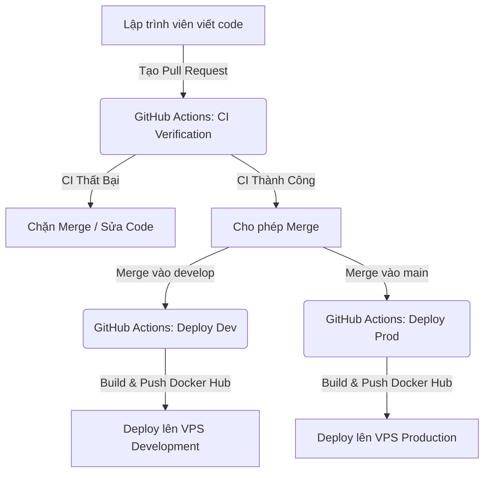

# Hướng dẫn Hệ thống CI/CD & Cấu hình Nhánh Bảo Vệ (Branch Ruleset)

Tài liệu này hướng dẫn chi tiết về quy trình Tích hợp và Triển khai liên tục (CI/CD) của hệ thống cùng cách thiết lập quy tắc bảo vệ trên GitHub.

---

## 1. Tổng quan Luồng CI/CD

Hệ thống CI/CD của chúng ta được chia thành **3 workflow độc lập** nằm trong thư mục `.github/workflows/`:

### Chi tiết các workflow:

1. **`ci.yml` (CI Verification - Chạy trên Pull Request)**
   * **Mục tiêu:** Kiểm tra chất lượng code tự động trước khi merge để đảm bảo không ai đưa lỗi lên các nhánh chính.
   * **Trigger:** Chạy tự động khi có bất kỳ Pull Request nào nhắm tới nhánh `develop` hoặc `main`.
   * **Các bước thực hiện:** Cài đặt dependencies, chạy quét lỗi cú pháp (`pnpm lint:all`), chạy build thử dự án (`pnpm build:all`).

2. **`deploy-dev.yml` (Deploy Dev - Triển khai Môi trường Dev)**
   * **Mục tiêu:** Tự động triển khai phiên bản phát triển lên VPS thử nghiệm sau khi code được duyệt.
   * **Trigger:** Khi code được `push` trực tiếp hoặc được merge từ PR vào nhánh `develop`.
   * **Các bước thực hiện:** Build các Docker images (`frontend`, `backend`, `nginx`) với tag `:dev`, đẩy lên Docker Hub, SSH vào VPS Dev và chạy docker-compose để cập nhật ứng dụng.

3. **`deploy-prod.yml` (Deploy Prod - Triển khai Môi trường Prod)**
   * **Mục tiêu:** Triển khai sản phẩm thực tế (Production) an toàn.
   * **Trigger:** Khi code được `push`/merge vào nhánh `main`.
   * **Các bước thực hiện:** Tự động build Docker images với tag `:latest` và cập nhật VPS Production.

---

## 2. Hướng dẫn cấu hình Nhánh Bảo Vệ (Repository Rulesets) trên GitHub

Để bảo vệ các nhánh `develop` và `main` không bị đẩy code lỗi trực tiếp, đồng thời bắt buộc mọi thay đổi phải đi qua Pull Request và pass qua kiểm tra CI, chúng ta cấu hình **Repository Rulesets** trên GitHub theo các bước sau:

### Bước 1: Truy cập trang quản lý Ruleset
1. Vào kho lưu trữ của dự án trên GitHub.
2. Click vào tab **Settings** (ở thanh menu trên cùng).
3. Trong cột menu bên trái, tìm mục **Code and automation** -> click chọn **Rules** -> **Rulesets**.

### Bước 2: Tạo Ruleset bảo vệ nhánh
1. Nhấn nút **New ruleset** và chọn **Import a ruleset** hoặc **Create a new ruleset** -> **New branch ruleset**.
2. **Cấu hình thông tin cơ bản:**
   * **Ruleset name:** Đặt tên rõ ràng (ví dụ: `Protect Main and Develop`).
   * **Enforcement status:** Chọn **`Active`** (Quy tắc sẽ áp dụng ngay lập tức và chặn người dùng nếu vi phạm).
3. **Mục Target branches:**
   * Chọn **Add target** -> **Include by pattern**.
   * Thêm hai pattern cho hai nhánh đích cần bảo vệ:
     * `develop`
     * `main`

### Bước 3: Cấu hình quy tắc bắt buộc
Kích hoạt các quy tắc sau bằng cách tích chọn:

1. **`Require a pull request before merging`** (Bắt buộc tạo PR):
   * Ngăn chặn hành động push code trực tiếp lên `develop`/`main`. Code bắt buộc phải đi qua Pull Request để được review.
2. **`Require status checks to pass before merging`** (Bắt buộc chạy CI xong):
   * Tích chọn mục này để không cho phép merge nếu CI lỗi.
   * Nhấn nút **Add check** (hoặc ô tìm kiếm).
   * Gõ chính xác tên Job kiểm tra: **`Code Quality & Build Checks`** và nhấn chọn nó.
   * *Lưu ý:* Check này chỉ hiển thị khi workflow `ci.yml` đã được chạy thử thành công ít nhất một lần trên một Pull Request.
3. **`Require branches to be up to date before merging`** (Đồng bộ code mới nhất):
   * Tích chọn mục này để đảm bảo nhánh Pull Request luôn cập nhật code mới nhất từ nhánh đích trước khi merge, tránh các xung đột code tiềm ẩn.

### Bước 4: Lưu cấu hình
* Cuộn xuống cuối trang và nhấn nút **Create** (hoặc **Save changes**).

---

## 3. Quy trình làm việc tiêu chuẩn (Standard Workflow) dành cho lập trình viên

1. Tạo nhánh tính năng mới từ nhánh `develop` (ví dụ: `feature/login-page`).
2. Viết code, tự chạy `pnpm lint:all` và `pnpm build:all` ở local để kiểm tra trước.
3. Commit và push nhánh tính năng lên GitHub. Husky sẽ tự động chạy pre-push check ở bước này.
4. Tạo Pull Request (PR) từ `feature/login-page` nhắm vào `develop`.
5. Hệ thống GitHub Actions sẽ tự động chạy workflow **CI Verification**.
6. Đợi CI chạy xong (chuyển sang màu xanh lá). Lúc này nút **Merge** mới được mở khóa.
7. Nhấn **Merge (Squash and Merge)**. Nhánh `develop` sẽ nhận code mới và kích hoạt tự động deploy lên VPS phát triển.
