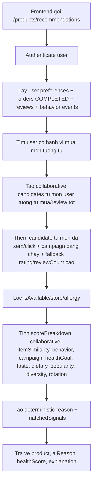
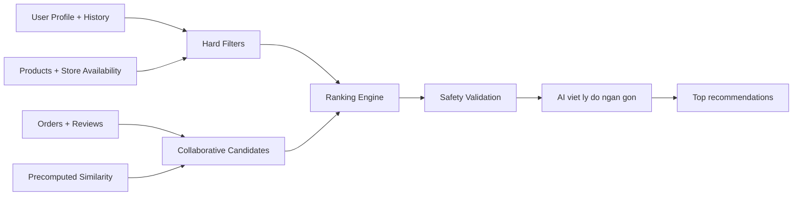
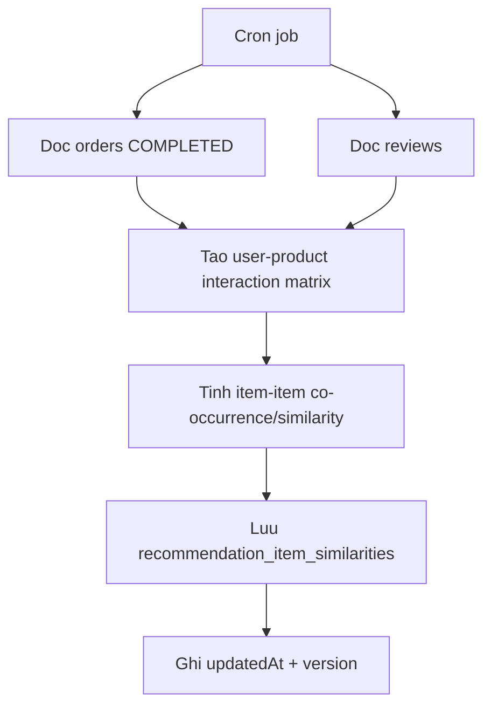
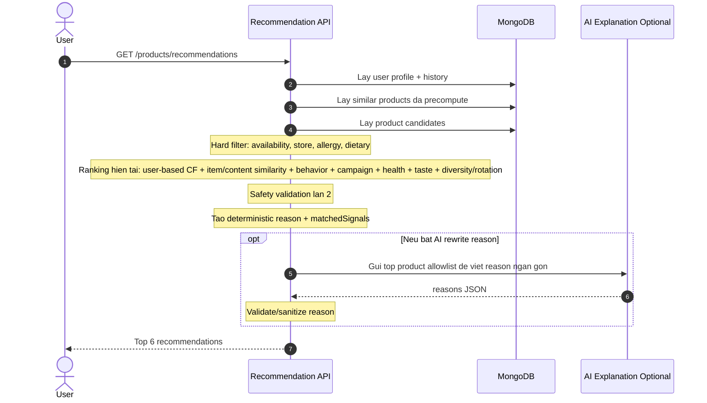

# HE THONG GOI Y MON AN PHU HOP VOI NGUOI DUNG FOA

Tai lieu nay mo ta cach phat trien tinh nang recommendation rieng cua FOA. Day la he thong goi y mon an tren trang chu/chi tiet mon/an toan suc khoe, khong phai chatbot hoi dap tu nhien.

Muc tieu kien truc: **Backend quyet dinh xep hang va an toan, AI chi ho tro dien dat ly do**. Recommendation khong duoc de AI tu do chon mon neu chua qua bo loc an toan, store availability va allowlist tu database.

---

## 1. Hien Trang Trong Du An

### API dang co

```txt
GET /products/recommendations
GET /products/safe-foods
GET /admin/customers/:userId/recommendation-insights
```

Frontend dang goi qua:

```txt
frontend/src/services/recommendation.service.ts
frontend/src/pages/Home/components/RecommendedSection.tsx
frontend/src/pages/FoodDetail/index.tsx
frontend/src/pages/SafeAlternatives/index.tsx
```

Backend dang xu ly o:

```txt
backend/src/controllers/recommendation.controller.ts
backend/src/services/recommendation-insights.service.ts
backend/src/services/product-behavior.service.ts
backend/src/services/health-risk.service.ts
backend/src/models/product-behavior-event.model.ts
```

### Luong hien tai



### Tieu chi hien tai

| Nhom | Dang dung | Vai tro |
|---|---|---|
| Availability | `isAvailable: true` | Loc bat buoc |
| Store | Co tham so `storeId`, nhung can kiem tra lai filter hien tai | Loc bat buoc trong ban production |
| Rating | `rating`, `reviewCount` | Chon candidate ban dau va fallback |
| Allergy | `preferences.allergies` + `recipe.ingredientId.allergenTags` | Loc bat buoc |
| Dietary | `preferences.dietary` | Tin hieu cho AI/ML |
| Health goals | `preferences.healthGoals` | Tin hieu cho AI/ML |
| Similar users | User co chung mon da mua/review + so thich | Tin hieu collaborative |
| Behavior | `product_behavior_events`: product view, recommendation click | Tin hieu quan tam nhe |
| Campaign | Campaign approved dang chay | Dua mon campaign vao candidate va boost co kiem soat |
| Rotation/diversity | Category da mua lap lai | Goi y mon khac de doi khau vi |
| Explanation | `explanation.reason`, `matchedSignals`, `scoreBreakdown` | Giai thich cho admin/customer, khong hien raw score tren UI |

### He thong hien tai dang la user-based hay item-based?

Ket luan ngan gon:

```txt
He thong hien tai la HYBRID recommender.
Trong do user-based collaborative filtering la signal chinh.
Item-based hien tai moi la content/item similarity nhe, chua phai item-based CF precompute dung nghia.
```

Bang phan loai ro rang:

| Lop | Hien tai co dung khong? | Dang lam gi? | Do manh |
|---|---:|---|---|
| User-based collaborative filtering | Co | Tim user khac co mon da mua trung voi user hien tai, tinh similarity, lay mon user tuong dong da mua/review tot | Chinh |
| Item-based collaborative filtering dung nghia | Chua | Chua co bang precompute "mon A thuong duoc mua cung/duoc mua sau mon B" tren toan bo order | Chua co |
| Item/content similarity | Co | So token `name`, `description`, `category`, `tags`, `healthTags` cua candidate voi mon user da mua/xem/review | Phu |
| Profile/content-based | Co | Match `dietary`, `healthGoals`, `tastes`, allergy safety | Phu quan trong |
| Behavior-based | Co | Dung `product_view`, `recommendation_click` lam tin hieu quan tam nhe | Phu |
| Business signal | Co | Campaign approved dang chay duoc dua vao candidate va boost nhe | Phu |
| Diversity/rotation | Co | Neu user mua lap mot nhom mon/category, tang mon khac category de doi khau vi | Phu |

Luong user-based hien tai:

```txt
1. Lay mon user hien tai da mua/review.
2. Tim cac user khac cung tung mua cac mon do.
3. Tinh similarity dua tren:
   - overlap mon da mua
   - overlap dietary/healthGoals/tastes
4. Lay mon ma user tuong dong da mua/review tot nhung user hien tai chua mua.
5. Dua cac mon do vao candidate va cong `collaborative`.
```

Luong item/content similarity hien tai:

```txt
1. Lay cac mon user da mua/review/xem.
2. Tao token tu name/description/category/tags/healthTags.
3. So Jaccard similarity voi mon candidate.
4. Cong `itemSimilarity` neu candidate giong mon user da quan tam.
```

Dieu can phan biet:

```txt
Item/content similarity != item-based collaborative filtering.

Item/content similarity:
  "Mon nay giong mon user tung mua/xem ve noi dung/tag/category."

Item-based collaborative filtering:
  "Nhung nguoi mua mon A thuong mua mon B, nen neu user mua A thi goi y B."
```

### Han che hien tai

1. Luong Home da dung explainable ranking engine, nhung chua co precompute nightly item similarity.
2. Collaborative filtering hien dang tinh bounded o request-time cho tung user, phu hop demo/MVP nhung can tach job neu data lon.
3. `preferences.tastes` da duoc dua vao score, nhung can chuan hoa taxonomy taste/tag tot hon.
4. Safe foods dang shuffle random, khong phai ranking on dinh.
5. Behavior events moi la aggregate theo ngay, chua co metric recommendation served/add-to-cart/order attribution day du.
6. Cache invalidation cho recommendation moi chua bat lai, hien uu tien tinh dung va co evidence truoc.

---

## 2. Muc Tieu Production

Recommendation production cua FOA nen gom 4 lop:

```txt
Hard Filters
  -> Candidate Generation
  -> Ranking/Scoring
  -> AI Explanation
```



Nguyen tac:

1. **AI khong duoc biet/tu quyet dinh gia tri he thong quan trong** nhu gia ban, inventory, store availability, payment, order.
2. **AI output la untrusted**: productId/reason/healthScore phai validate va sanitize.
3. **An toan suc khoe la hard filter**: allergy conflict phai loai truoc ranking va loai lai sau ranking.
4. **Request-time phai nhanh**: collaborative similarity nen duoc tinh nen dinh ky, khong tinh full matrix moi request.

---

## 3. Du Lieu Su Dung Cho Recommendation

### User profile

```txt
preferences.dietary
preferences.allergies
preferences.healthGoals
preferences.tastes
```

Y nghia:

| Field | Cach dung |
|---|---|
| `allergies` | Hard filter, khong recommend mon co allergen trung |
| `dietary` | Hard/soft constraint tuy loai: chay co the la hard, low-fat co the la soft |
| `healthGoals` | Cong diem cho mon phu hop suc khoe |
| `tastes` | Cong diem cho mon hop khau vi: cay, ngot, thanh dam, lanh, it beo |

### Product

```txt
name
description
category
tags
healthTags
recipe
price
rating
reviewCount
isAvailable
storeId / store availability
```

### Behavior data

```txt
orders.status = COMPLETED
orders.items.productId
orders.items.quantity
reviews.rating
reviews.feedbackTags
reviews.createdAt
product_behavior_events.eventType = product_view | recommendation_click
product_behavior_events.count
product_behavior_events.lastSeenAt
campaigns.status = approved
campaigns.startTime/endTime
campaigns.products
```

Score implicit/explicit co the quy doi nhu sau:

| Tin hieu | Diem goi y |
|---|---:|
| Review 5 sao | 5.0 |
| Review 4 sao | 4.0 |
| Review 3 sao | 3.0 |
| Review 1-2 sao | 1.0 - 2.0, co the dung lam negative signal |
| Da mua, chua review | 3.2 - 3.8 |
| Mua lap lai | Tang nhe theo `log(quantity/count)` |
| Mua gan day | Tang nhe neu can ca nhan hoa theo recency |
| Da xem mon | Tin hieu nhe, khong manh bang order/review |
| Click tu khu vuc goi y | Tin hieu quan tam manh hon view |
| Mon dang campaign | Boost nhe neu van qua loc availability/allergy/store |
| Mua lap category qua nhieu | Tang rotation/diversity cho mon khac category |

---

## 4. Collaborative Filtering Co The Ap Dung

Tai lieu "Making Recommendations" dua ra 2 huong chinh: user-based va item-based collaborative filtering.

### 4.1 User-Based Collaborative Filtering

Y tuong:

```txt
Tim user co hanh vi mua/rating giong user hien tai
Lay mon ho thich nhung user hien tai chua mua/rating
Tinh diem mon bang trung binh co trong so similarity
```

Cong thuc:

```txt
score(product)
= sum(similarity(currentUser, otherUser) * otherUserProductScore)
  / sum(similarity(currentUser, otherUser))
```

Metric co the dung:

| Metric | Hop voi |
|---|---|
| Pearson | Rating 1-5, khi moi user co thang diem khac nhau |
| Cosine | Sparse matrix, implicit + explicit score |
| Jaccard | Da mua/chua mua, binary interaction |
| Euclidean | Dataset nho, demo don gian |

Nhan xet voi FOA:

```txt
Ap dung duoc, nhung khong nen la huong chinh.
```

Ly do:

1. Du lieu order food thuong sparse, moi user chi mua it mon.
2. Moi request neu so sanh voi tat ca user se cham khi data tang.
3. User moi khong co lich su se bi cold-start.

Nen dung user-based nhu **secondary signal**, khong dung lam engine duy nhat.

### 4.2 Item-Based Collaborative Filtering

Y tuong:

```txt
Tinh truoc mon nao tuong tu mon nao dua tren hanh vi mua/rating
Khi user can recommendation, lay mon user da thich/mua
Tra bang similarity de lay mon tuong tu
```

Vi du:

```txt
Nguoi mua Com ga thuong mua Tra dao
Nguoi thich Salad uc ga cung hay thich Sua bap
```

Day la huong nen uu tien cho FOA.

Ly do:

1. So mon an thuong it hon so user/order.
2. Similarity giua mon on dinh hon similarity giua user.
3. Co the precompute vao ban dem, request-time chi lookup nhanh.
4. Rat phu hop voi food app: "hay mua kem", "mon tuong tu", "combo goi y".

---

## 5. Kien Truc De Xuat

### 5.1 Offline Job: Precompute Similarity

Chay dinh ky bang `node-cron` hoac script rieng.

Tan suat de xuat:

| Giai doan | Lich chay |
|---|---|
| MVP/do an | Moi ngay luc 02:00 |
| Co nhieu order | Moi 6 tieng |
| Production lon | Incremental update khi order COMPLETED/review moi + nightly rebuild |

Luong tinh toan:



Schema de xuat:

```ts
// collection: recommendation_item_similarities
{
  productId: ObjectId,
  similarProductId: ObjectId,
  score: number,
  coPurchaseCount: number,
  coReviewCount: number,
  support: number,
  algorithm: 'item_cosine_v1' | 'jaccard_v1' | 'co_purchase_v1',
  computedAt: Date
}
```

Index can co:

```ts
{ productId: 1, score: -1 }
{ similarProductId: 1 }
{ computedAt: -1 }
{ productId: 1, similarProductId: 1 } unique
```

### 5.2 Request-Time Ranking

Khi frontend goi `/products/recommendations`:



Ranking score hien tai trong code request-time:

```txt
finalScore =
  0.24 * collaborative
+ 0.15 * itemSimilarity
+ 0.10 * behavior
+ 0.08 * campaign
+ 0.13 * healthGoal
+ 0.12 * taste
+ 0.07 * dietary
+ 0.06 * popularity
+ 0.03 * diversity
+ 0.02 * rotation
```

Trong do:

| Score | Cach tinh goi y |
|---|---|
| `collaborative` | Diem tu user-based collaborative filtering |
| `itemSimilarity` | Content similarity voi mon user da mua/xem/review, chua phai item-based CF precompute |
| `behavior` | Tin hieu tu `product_view` va `recommendation_click` |
| `campaign` | Boost nhe cho mon dang co campaign approved va con hieu luc |
| `healthGoal` | Match `healthTags`, `tags`, description voi `healthGoals` |
| `taste` | Match `preferences.tastes` voi `tags/healthTags/category/description` |
| `dietary` | Match `dietary`, truong hop hard dietary thi filter truoc |
| `popularity` | Normalize `rating`, `reviewCount`, sold count |
| `diversity` | Giam trung category de top 6 khong qua mot mau |
| `rotation` | Tang mon khac category neu user mua lap mot nhom mon qua nhieu |

Hard filters phai chay truoc scoring:

```txt
isAvailable = true
store availability hop le
khong conflict allergies
khong conflict dietary hard constraints
khong bi admin disable
khong bi het hang neu co inventory
```

---

## 6. Cold-Start Strategy

### User moi chua co order/review

Dung fallback:

```txt
health-safe + dietary/healthGoals/tastes match + rating/reviewCount + diversity
```

Neu user chua co profile:

```txt
popular products + diverse category + campaign/new items
```

### Product moi chua co interaction

Khong nen de product moi bien mat khoi recommendation. Them exploration:

```txt
newProductBoost neu createdAt gan day
category/tag similarity voi user profile
rating fallback neu co review som
```

### Data qua it

Neu similarity table chua du support:

```txt
fallback deterministic scorer
khong goi AI de quyet dinh chinh
```

---

## 7. AI Role

AI nen duoc dung de:

```txt
viet ly do ngan gon
dien dat than thien
giai thich vi sao mon hop voi health/taste
```

AI khong nen duoc dung de:

```txt
tu chon mon ngoai allowlist
tu quyet dinh mon an toan hay khong
tu tinh gia/tong tien
tu doc/ghi order/payment/inventory
```

Prompt nen chi gui top candidates da duoc backend chon:

```json
{
  "userPreferences": {
    "dietary": ["..."],
    "healthGoals": ["..."],
    "tastes": ["..."]
  },
  "products": [
    {
      "productId": "...",
      "name": "...",
      "scoreReasons": ["hop khau vi cay", "rating cao", "nguoi tuong tu hay mua"]
    }
  ]
}
```

Output bat buoc validate:

```json
{
  "reasons": [
    {
      "productId": "...",
      "reason": "Phu hop voi khau vi cay va muc tieu an thanh dam."
    }
  ]
}
```

Neu AI timeout:

```txt
Tra ve reason deterministic tu scoreReasons
Khong lam hong recommendation response
```

---

## 8. Cache Va Invalidation

Cache recommendation nen phu thuoc vao:

```txt
userId
storeId
preferencesHash
lastProductUpdatedAt
lastSimilarityComputedAt
lastUserInteractionAt
```

Cache key goi y:

```txt
recommendations:${userId}:${storeId}:${preferencesHash}:${similarityVersion}
```

Khi can invalidate:

| Su kien | Cach xu ly |
|---|---|
| User doi allergies/dietary/healthGoals/tastes | Xoa cache user |
| Product update recipe/tags/healthTags/availability/price | Xoa cache lien quan hoac dung product updatedAt |
| Similarity job rebuild | Tang `similarityVersion` |
| User co order COMPLETED moi | Xoa cache user |
| User review mon | Xoa cache user |

---

## 9. Roadmap Trien Khai

### Phase 1 - Deterministic Ranking Nen Tang

Muc tieu: giam phu thuoc vao AI, ranking on dinh hon.

Viec can lam:

1. Tao `recommendation-ranking.service.ts`.
2. Dua hard filter vao service rieng: availability/store/allergy/dietary.
3. Them scoring deterministic: rating, reviewCount, healthGoals, tastes, dietary.
4. AI chi viet reason, fallback deterministic reason khi timeout.
5. Fix store filter neu endpoint dang nhan `storeId` nhung filter chua ap dung.

Acceptance criteria:

```txt
Khong co AI van tra duoc recommendations.
Mon conflict allergy khong xuat hien.
Top 6 co score/reason ro rang.
Build backend pass.
```

### Phase 2 - Item-Based Collaborative Filtering

Muc tieu: ap dung ky thuat recommendation trong tai lieu vao du an.

Viec can lam:

1. Tao model `RecommendationItemSimilarity`.
2. Tao job/script rebuild similarity tu `orders` va `reviews`.
3. Tinh interaction score cho user-product.
4. Tinh item-item similarity bang cosine/Jaccard/co-purchase.
5. Luu top N similar products moi product.
6. Request-time lay mon user da mua/rating, tra similar table de tao candidates.

Acceptance criteria:

```txt
Job rebuild chay idempotent.
Similarity collection co du lieu.
API recommendations co `itemSimilarity`/`collaborative` va evidence tu bang similarity.
Neu similarity rong, fallback ranking van chay.
```

### Phase 3 - User-Based Secondary Signal

Muc tieu: them tin hieu "nguoi giong ban hay mua".

Viec can lam:

1. Tao user interaction vector tu order/review.
2. Tinh top similar users bang cosine/Pearson voi gioi han data.
3. Lay mon user tuong tu thich nhung current user chua mua gan day.
4. Cong vao final score voi trong so nho.

Acceptance criteria:

```txt
Khong scan toan bo user moi request neu data lon.
Co cap/max query ro rang.
Khong leak thong tin user khac ra response.
```

### Phase 4 - Observability Va Evaluation

Muc tieu: do chat luong recommendation.

Can log metric khong chua PII nhay cam:

```txt
recommendation_served
recommendation_clicked
recommendation_added_to_cart
recommendation_ordered
recommendation_hidden/skipped
algorithm_version
score_breakdown
fallback_reason
```

Chi so can theo doi:

```txt
CTR: click / impressions
ATC rate: add-to-cart / impressions
Conversion: ordered / impressions
Health safety violations: phai bang 0
AI timeout rate
Fallback rate
```

---

## 10. Explainability Va Evidence

Recommendation cua FOA khong chi can tra ve danh sach mon. He thong phai tra duoc **bang chung vi sao mon do duoc goi y**, de co the demo, debug va chung minh tinh nang that su hoat dong.

### 10.1 Muc tieu evidence

Moi recommendation nen tra ve 3 lop giai thich:

```txt
Human reason
  Ly do ngan gon cho nguoi dung doc

Score breakdown
  Diem so tung tin hieu: collaborative, health, taste, rating, diversity

Evidence trace
  Du lieu nao da dong gop vao diem: similar users, similar products, order/review signals
```

Vi du:

```txt
"Salad Uc Ga Sot Me Rang" duoc goi y vi:
- Hop muc tieu "it beo", "tang protein"
- User co khau vi "thanh dam" va mon nay co tag healthy
- 3 user co do tuong dong cao voi ban cung da mua/danh gia tot mon nay
- Mon nay co rating 4.7 voi 31 reviews
```

### 10.2 Response shape de xuat

Endpoint `/products/recommendations` nen tra them `explanation` cho moi item:

```ts
type RecommendationExplanation = {
  reason: string;
  algorithmVersion: string;
  finalScore: number;
  scoreBreakdown: {
    collaborative: number;
    itemSimilarity: number;
    userSimilarity: number;
    healthGoal: number;
    taste: number;
    dietary: number;
    popularity: number;
    diversity: number;
  };
  matchedSignals: string[];
  similarUsers: Array<{
    userIdHash: string;
    similarity: number;
    sharedSignals: string[];
    supportingProducts: Array<{
      productId: string;
      productName: string;
      signal: 'ordered' | 'reviewed';
      score: number;
    }>;
  }>;
  similarProducts: Array<{
    productId: string;
    productName: string;
    similarity: number;
    source: 'co_purchase' | 'co_review' | 'tag_similarity';
  }>;
};
```

Luu y privacy:

```txt
Khong tra email, fullName, phone cua similar users.
Chi tra userIdHash hoac label an danh nhu "Nguoi dung tuong tu #1".
Khong tra chi tiet don hang rieng tu.
Chi tra aggregate/supporting signal da duoc an danh.
```

### 10.3 Admin insight endpoint cho admin/demo

De chung minh tinh nang hoat dong, he thong co endpoint insight rieng cho admin/staff khi xem ho so khach hang:

```txt
GET /admin/customers/:userId/recommendation-insights
```

Response insight co the day du hon response cho customer:

```json
{
  "userId": "current-user-id",
  "algorithmVersion": "hybrid_item_cf_v1",
  "profile": {
    "dietary": ["healthy"],
    "healthGoals": ["low_fat"],
    "tastes": ["thanh_dam"]
  },
  "topSimilarUsers": [
    {
      "userIdHash": "u_8f2a",
      "similarity": 0.82,
      "sharedSignals": ["healthGoal:low_fat", "taste:thanh_dam"],
      "topProducts": [
        {
          "productName": "Salad Uc Ga Sot Me Rang",
          "signal": "reviewed",
          "score": 5
        }
      ]
    }
  ],
  "recommendations": [
    {
      "productName": "Salad Uc Ga Sot Me Rang",
      "finalScore": 0.86,
      "scoreBreakdown": {
        "collaborative": 0.31,
        "itemSimilarity": 0.18,
        "behavior": 0.1,
        "campaign": 0,
        "healthGoal": 0.22,
        "taste": 0.15,
        "popularity": 0.12,
        "diversity": 0.06,
        "rotation": 0.02
      },
      "evidence": [
        "3 similar users ordered/reviewed this product",
        "matches health goal: low_fat",
        "matches taste: thanh_dam",
        "rating 4.7 from 31 reviews"
      ]
    }
  ]
}
```

Endpoint nay phai duoc bao ve:

```txt
authenticate + authorize ADMIN/STAFF
```

### 10.4 Evidence tu user similarity

Khi dung user-based collaborative filtering, he thong nen luu/tra duoc:

```txt
top similar users
similarity score
shared products / shared preferences
mon ma similar users da mua/review tot
mon nao tu do duoc day vao recommendations
```

Vi du tinh do tuong dong:

```txt
User hien tai:
  Da mua: Com ga, Tra dao, Salad uc ga
  Review tot: Salad uc ga = 5

User B:
  Da mua: Com ga, Tra dao, Bun cha ca
  Review tot: Bun cha ca = 5

Similarity(User, B) = 0.78
=> Bun cha ca duoc dua vao candidate vi User B giong user hien tai va danh gia tot mon nay.
```

Evidence hien thi:

```txt
"Duoc goi y vi nhom nguoi dung co lich su goi mon tuong tu ban cung danh gia cao mon nay."
```

Debug evidence:

```txt
similarUsers: [
  {
    similarity: 0.78,
    sharedSignals: ["ordered:Com ga", "ordered:Tra dao"],
    supportingProducts: ["Bun cha ca"]
  }
]
```

### 10.5 Evidence tu item/content similarity va item-based CF

Trang thai hien tai:

```txt
Da co: item/content similarity
Chua co: item-based collaborative filtering precompute bang co-purchase/co-review
```

Hien tai item/content similarity dang lam:

```txt
User thich/mua/xem mon A
Mon B co token/tag/category/description giong A
=> Mon B duoc cong itemSimilarity
```

Vi du:

```txt
User tung mua "Com ga xoi mo"
"Com tam suon" co category/tag/noi dung gan voi "Com ga xoi mo"
=> Goi y "Com tam suon" voi evidence "Tuong tu voi mon da tung mua/xem"
```

Item-based collaborative filtering dung nghia nen lam o phase sau:

```txt
Doc toan bo orders COMPLETED / reviews tot
Tinh cap mon thuong duoc mua cung nhau hoac review tot boi cung user
Luu vao bang item_similarity
Request-time chi doc bang precompute
```

Khi co item-based CF:

```txt
User thich/mua mon A
Mon B co similarity cao voi A
=> Mon B duoc goi y
```

Vi du:

```txt
User tung mua "Com ga xoi mo"
"Tra dao cam sa" co co-purchase similarity 0.74 voi "Com ga xoi mo"
=> Goi y "Tra dao cam sa"
```

Evidence hien thi:

```txt
"Thuong duoc goi kem voi mon ban da mua gan day."
```

Debug evidence:

```txt
similarProducts: [
  {
    productName: "Com ga xoi mo",
    similarity: 0.74,
    source: "tag_similarity" // hien tai
    // source: "co_purchase" // sau khi co item-based CF precompute
  }
]
```

### 10.6 Reason templates

Backend nen tao reason deterministic tu score/evidence, AI chi duoc rewrite ngan gon neu can.

Template goi y:

| Tin hieu | Reason |
|---|---|
| Taste match | `Phu hop voi khau vi {taste} cua ban.` |
| Health goal match | `Phu hop voi muc tieu {healthGoal}.` |
| Item/content similarity | `Tuong tu voi {productName} ma ban da tung mua/xem.` |
| Item-based CF | `Thuong duoc goi kem voi {productName} ma ban da tung mua.` |
| User similarity | `Nhom nguoi dung co hanh vi goi mon tuong tu ban cung thich mon nay.` |
| Behavior | `Ban da xem/mo mon nay tu khu vuc goi y gan day.` |
| Campaign | `Mon nay dang co chien dich uu dai phu hop.` |
| Rotation | `Goi y de ban doi khau vi so voi nhom mon da mua lap lai.` |
| Popularity | `Duoc nhieu khach danh gia tot.` |
| Safe allergy | `Da duoc loc khong xung dot voi ho so di ung hien tai.` |

Neu AI timeout, dung template nay de tra reason.

### 10.7 Acceptance criteria rieng cho explainability

```txt
Moi product recommendation co finalScore va scoreBreakdown.
Moi product co it nhat 1 matchedSignal.
Neu `collaborative` hoac `itemSimilarity` > 0, response/debug phai chi ra signal den tu user/item similarity.
Khong expose PII cua similar users.
AI timeout khong lam mat explanation.
Debug endpoint cho thay top similar users va recommended products tu tung user/item signal.
```

---

## 11. Checklist An Toan

Truoc khi merge recommendation changes:

- [ ] Khong doc/ghi `.env` trong code/test.
- [ ] Khong gui secret/JWT/payment data sang AI provider.
- [ ] AI output duoc validate va sanitize.
- [ ] ProductId tra ve phai nam trong allowlist tu DB.
- [ ] Allergy conflict bi loai truoc va sau ranking.
- [ ] Store availability duoc xu ly dung.
- [ ] Query Mongo co limit/index hop ly.
- [ ] Fallback khong AI van tra duoc ket qua.
- [ ] Cache invalidation khong lam user nhan mon khong con available.
- [ ] Backend `pnpm build` pass.
- [ ] Explanation khong leak PII/order private data cua user khac.
- [ ] Debug endpoint duoc bao ve bang role hoac chi bat o non-production.

---

## 12. De Xuat Cau Truc File Khi Trien Khai

```txt
backend/src/models/recommendation-item-similarity.model.ts
backend/src/services/recommendation-ranking.service.ts
backend/src/services/recommendation-similarity.service.ts
backend/src/services/recommendation-explanation.service.ts
backend/src/jobs/recommendation-similarity.job.ts
backend/src/scripts/rebuild-recommendation-similarity.ts
backend/src/utils/recommendation-score.util.ts
```

Vai tro:

| File | Vai tro |
|---|---|
| `recommendation-ranking.service.ts` | Request-time ranking, hard filter, score final |
| `recommendation-similarity.service.ts` | Tinh/lap lich/lookup item similarity |
| `recommendation-explanation.service.ts` | Tao reason/evidence trace, sanitize debug output |
| `recommendation-item-similarity.model.ts` | Luu ket qua precompute |
| `recommendation-similarity.job.ts` | Cron job nightly rebuild |
| `rebuild-recommendation-similarity.ts` | Script manual rebuild |
| `recommendation-score.util.ts` | Normalize score, diversity, reason templates |

---

## 13. Tom Tat Quyet Dinh

Huong nen di:

```txt
Item-based collaborative filtering
+ deterministic ranking engine
+ health/allergy hard filter
+ AI explanation only
+ nightly precompute job
```

Khong nen di:

```txt
Moi request tinh full collaborative filtering
De AI tu chon mon chinh
Chi dua vao user profile giong nhau
Bo qua tastes/order/review signals
```

Kien truc nay giup recommendation nhanh hon, it timeout hon, de giai thich hon va phu hop voi production hon cho mot food-ordering system.
